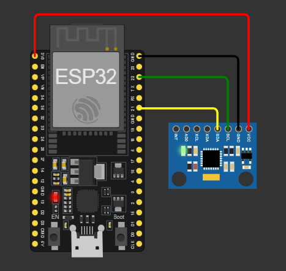

# Step 1: Wiring ESP32 and MPU6050

The MPU6050 communicates using **I2C**, requiring only **SDA** and **SCL** lines.

| **MPU6050 Pin** | **ESP32 Pin**        |
|---------------|--------------------|
| **VCC**      | 3.3V or 5V         |
| **GND**      | GND                |
| **SCL**      | GPIO 22 (I2C SCL)  |
| **SDA**      | GPIO 21 (I2C SDA)  |
